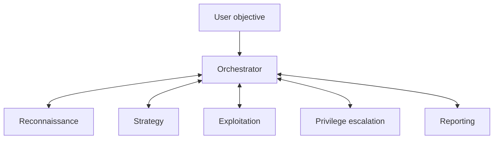

# Local Multi-Agent System for LLM-Assisted Pentesting

[](https://www.python.org/)
[](https://ollama.com/)
[](https://qwenlm.github.io/)
[](LICENSE)

This repository contains the implementation developed for the Master's Thesis **“Diseño y evaluación de un sistema multiagente local para pentesting asistido por LLMs”** at the University of Murcia.

The project extends [Cybersecurity AI (CAI) v0.5.10](https://github.com/aliasrobotics/cai) with a local, role-based multi-agent architecture for assisted penetration testing. Its main focus is not simply adding more agents, but making collaboration between local language models more reliable: isolating their contexts, handing off concise structured evidence, constraining completion, recovering from malformed actions, and exposing only the tools needed for the current task.

## Master's Thesis

The complete Master's Thesis is available as a [PDF](https://github.com/viictorsauraa/cai-multiagent-tfm/releases/download/tfm-2026/TFM.pdf).

> [!IMPORTANT]
> Use this software only in systems you own or are explicitly authorised to test. The evaluation described below was performed in controlled laboratory environments.

## At a glance

| Item | Value |
|---|---|
| Architecture | Hub-and-spoke orchestration with specialised agents |
| Agent patterns | Red Team and Bug Bounty, with 6 roles in each team |
| Execution | Hub-and-spoke handoffs; one delegated specialist works at a time |
| Models | Role-specific Qwen models served locally through Ollama |
| Evaluation | 17 vulnerable machines, 3 assistance levels, 51 runs |
| Strictly verified successes | 18/51 (35.29%) |
| Challenges solved at least once | 9/17 (52.94%) |
| Solved from target-only, black-box instructions | 6/17 |

## Architecture

The orchestrator decomposes the objective and delegates bounded subtasks to specialised agents. The roles are not run as a fully parallel swarm: the orchestrator activates the specialist needed for the current phase, and that specialist hands control back when its bounded task is complete. Each agent maintains an isolated conversation history and returns a compact structured briefing instead of transferring its complete context. This preserves useful role-specific state without filling every model's context with the complete session.



| Role | Default model | Responsibility |
|---|---|---|
| Orchestrator | `qwen2.5:72b` | Plan, delegate, validate progress, and decide the next phase |
| Reconnaissance | `qwen3:14b` | Discover and enumerate the target's exposed surface |
| Strategy | `qwen2.5:72b` | Analyse confirmed findings and define the attack plan |
| Exploitation | `qwen2.5:32b` | Execute the selected exploitation steps |
| Privilege escalation | `qwen2.5:32b` | Inspect the compromised system and seek higher privileges |
| Reporting | `qwen3:14b` | Collect evidence and produce the final report |

These are fallback defaults for the Red Team pattern and can be overridden with `CAI_ORCH_MODEL`, `CAI_RECON_MODEL`, `CAI_STRATEGY_MODEL`, `CAI_EXPLOIT_MODEL`, `CAI_PRIVESC_MODEL`, and `CAI_REPORT_MODEL`. The assignments and handoffs are defined in [`src/cai/agents/patterns/redteam_orchestrated.py`](src/cai/agents/patterns/redteam_orchestrated.py).

## Main engineering contributions

### Reliable orchestration

- Strict model locking prevents an agent from silently inheriting another agent's model after a handoff.
- Per-agent message histories avoid cross-role context contamination.
- Structured handoff briefings carry objectives, confirmed findings, evidence, unsuccessful attempts, and suggested next steps.
- The orchestrator can resume an existing specialist instead of recreating it and losing its state.
- A `can_finish` gate prevents specialist agents from ending the complete session; only the orchestrator and reporting role may do so.
- Repetition detection and handoff limits reduce stalled delegation loops.

### Context engineering for local models

- Ollama context windows are adjusted dynamically by model family and size.
- History is compacted when needed while preserving system instructions and recent operational evidence.
- Tool outputs are normalised and truncated before they overwhelm the model context.
- Malformed tool calls and incomplete handoffs are repaired when recovery is unambiguous.

### Tool execution extensions

- The inherited CAI execution layer is extended with process-tree-aware timeout handling for long-running commands.
- Sixteen reusable profiles add safe defaults, timeouts, and output reduction for command-line tools such as Nmap, sqlmap, Hydra, ffuf, and Dalfox.
- Native web toolkits encapsulate common XSS, JWT, LFI, and file-upload operations.
- MCP integration examples are included for OWASP ZAP and Burp Suite.

### Selective web-tool activation

The web-exploitation toolkits are deliberately **not exposed all at once**. Every tool definition consumes context and increases the action-selection burden on local models, so only the toolkit relevant to the current vulnerability family should be enabled.

The repository includes native toolkits for XSS, JWT, LFI, and file-upload workflows, alongside command profiles for tools such as sqlmap and web crawlers. During the evaluation, the relevant native toolkit was activated explicitly for each test family. In the checked-in exploitation-agent configuration, the file-upload toolkit is enabled as an example; the other native toolkits remain available for selective activation.

## Evaluation

The system was evaluated on 17 intentionally vulnerable machines covering SQL injection, JWT weaknesses, local file inclusion, unrestricted file upload, cross-site scripting, and password cracking. Each machine was tested once at each of three assistance levels:

1. **Black box:** only the target address and final objective.
2. **Guided:** the vulnerable endpoint or component was identified.
3. **Highly guided:** the vulnerability class and additional exploitation guidance were supplied.

A run counted as successful only when the expected flag was recovered and independently verified.

| Vulnerability family | Verified successes | Runs | Success rate |
|---|---:|---:|---:|
| Password cracking | 5 | 6 | 83.33% |
| SQL injection | 6 | 9 | 66.67% |
| JWT | 3 | 6 | 50.00% |
| Local file inclusion | 3 | 12 | 25.00% |
| File upload | 1 | 9 | 11.11% |
| Cross-site scripting | 0 | 9 | 0.00% |
| **Total** | **18** | **51** | **35.29%** |

Nine of the 17 challenges were solved in at least one configuration. Six were completed from the black-box instruction alone. Three additional runs achieved a real compromise but could not retrieve the expected flag, so they were excluded from the strict success count.

The evaluation also identified six false-success declarations, five of them in LFI tests. This is an important result: successful command execution is not enough. Autonomous security agents need explicit evidence checks, especially when distinguishing a promising exploit attempt from completion of the actual objective.

The complete challenge-level outcome matrix, protocol, and aggregation tables are published in the [evaluation documentation](docs/EVALUATION.md) and as [machine-readable CSV data](results/evaluation_runs.csv).

## Scope and limitations

- The experiments cover web-focused laboratory challenges; they do not establish general autonomous-pentesting performance.
- Every challenge/assistance combination was run once, so the results do not measure run-to-run variance.
- The three assistance levels are not direct model baselines: occasional human interventions redirected the workflow but did not provide the solution.
- All roles used one fixed model assignment; the thesis did not perform an exhaustive comparison of model combinations.
- Privilege escalation had little representation in the selected benchmark.
- No uncontrolled real-world deployment was performed or is implied.

## Installation

The implementation was developed and evaluated on Ubuntu with Python 3.12. Local model execution requires an Ollama server with enough memory for the selected models; the original experiments used a separate inference server with access to two NVIDIA A100 GPUs.

```bash
git clone https://github.com/viictorsauraa/cai-multiagent-tfm.git
cd cai-multiagent-tfm

python3.12 -m venv .venv
source .venv/bin/activate
pip install --upgrade pip
pip install -e .

cp .env.example .env
```

Pull the configured models on the Ollama host:

```bash
ollama pull qwen2.5:72b
ollama pull qwen2.5:32b
ollama pull qwen3:14b
```

Then set the Ollama-compatible endpoint in `.env`, for example:

```dotenv
OLLAMA_API_BASE=http://127.0.0.1:11434/v1
```

## Running the system

Start the role-based workflow with the `redteam_orchestrated_pattern` agent:

```bash
CAI_AGENT_TYPE="redteam_orchestrated_pattern" \
cai --continue --prompt "Pentest 172.17.0.2 and obtain the flag"
```

Use `/state` to inspect the stored multi-agent state and `/continue` to resume the workflow from the interactive CLI. See [`docs/CAI_GUIDE.md`](docs/CAI_GUIDE.md) for configuration and operating details.

## Tests

Install the test dependencies and run the suite from the repository root:

```bash
pip install -e ".[test]"
pytest -q
```

The tests cover multi-agent state, handoffs, model locking, context management, loop detection, tool profiles, timeouts, and related reliability mechanisms.

## Repository layout

```text
src/cai/agents/      agent definitions and orchestration logic
src/cai/repl/        CLI, handoff, history, and state handling
src/cai/tools/       command, web, and custom tool integrations
tests/               unit and integration-oriented tests
docs/                technical and evaluation guides
```

## Documentation

- [Technical guide to the fork](docs/CAI_GUIDE.md)
- [Evaluation protocol and machine-level results](docs/EVALUATION.md)
- [XSS and OWASP ZAP MCP guide](docs/XSS_MCP_GUIDE.md)
- [File-by-file changes from upstream CAI](CHANGES.md)

## Citing this work

If you use this implementation in academic work, please cite both the Master's Thesis and the original CAI framework:

```bibtex
@mastersthesis{saura_meseguer_2026_multiagent,
  author = {Saura Meseguer, Víctor},
  title = {Diseño y evaluación de un sistema multiagente local para pentesting asistido por LLMs},
  school = {Universidad de Murcia},
  year = {2026}
}

@misc{mayoralvilches2025caiopenbugbountyready,
  title = {CAI: An Open, Bug Bounty-Ready Cybersecurity AI},
  author = {Víctor Mayoral-Vilches and Luis Javier Navarrete-Lozano and María Sanz-Gómez and Lidia Salas Espejo and Martiño Crespo-Álvarez and Francisco Oca-Gonzalez and Francesco Balassone and Alfonso Glera-Picón and Unai Ayucar-Carbajo and Jon Ander Ruiz-Alcalde and Stefan Rass and Martin Pinzger and Endika Gil-Uriarte},
  year = {2025},
  eprint = {2504.06017},
  archivePrefix = {arXiv},
  primaryClass = {cs.CR},
  url = {https://arxiv.org/abs/2504.06017}
}
```

## License and acknowledgements

This repository combines MIT-licensed components with additions covered by the research-use terms described in [LICENSE](LICENSE) and [LICENSE-MIT](LICENSE-MIT).

It builds on [Cybersecurity AI (CAI)](https://github.com/aliasrobotics/cai). The thesis implementation and evaluation should therefore be understood as an extension of that project, with the upstream authors credited for the original framework.
